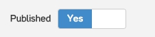

## Templates

The main parts in KMS are Templates and Pages. And its usage is very simple.
Each Template contains common html code, i.e. `<html>`, `<head>` and etc. And each Page embeds its content into Template via &#123;% yield %&#125;

Start adding your first template by clicking on "Add template" button on Templates section. Give it some name, paste your HTML code and place `yield` tag where you want page content to be rendered.


## Pages

Now you can create first Page using "Add page" button on Pages section. It will be your root page (that points to "/" has special "index" slug).

For now, you just need to specify Page title and Template it belongs to. Also you can provide some content and don't forget to turn on "Published" switch toggle.



!> "Published" toggle makes page available at its slug.

Other useful option - "Hidden (from navigation)" - allows you to distinguish pages that should be published too but not visible in your main navigation menu.

## Assets

After steps above, you can check website at your root url. Now you need to have your assets in place. Press "Add asset" and pick files for upload. You can upload multiple files at once.


After upload you'll get files grouped by tabs - Images, Stylesheets, Javascript, etc. Now it's possible to use these files in Templates.

You have at least 3 ways of doing it:

1. Using file path (i.e. `/uploads/kms/asset/file/1/animate.css`). Just replace in your `<script src="..."` or `<link href="..."`
2. Using asset_path filter:

  ```html
  <link rel="stylesheet" href="{{ 'bootstrap.min.css' | asset_path }}">
  ```

3. Using asset_tag filter that can generate `link` or `script` tag:
  ```handlebars
  {{ 'bootstrap.min.css' | asset_tag }}
  ```

Once you did this for all assets, you should get a better view of your website. It's time to create dynamic menu/navigation.

## Using Liquor

To make something dynamic in KMS, you need to use Liquor language and variables giving access to some parts of KMS. For example, there's `index` object that gives you access to root page (that we've created as our first page). This object has properties and one that we need is `index.children`. It allows us to iterate over pages.


  ```handlebars
  <nav role="navigation">
    <ul>
      
        <li>
          <a href="/{{ p.fullpath }}">{{ p.title }}</a>
        </li>
      
    </ul>
  </nav>
  ```


Notice that we can also filter children using `find_all_by` method. In this case we want to display only published and visible for navigation pages.

Great! Now we have dynamic menu and can walk through pages.

## Snippets

Next possible step to improve our website structure is to use Snippets. Snippets are just pieces of html that can be included into Templates or Pages. For example, you may need to extract `<head>` content into Snippet or your main menu written above. Press "Add snippet", give it a name and slug and write some content.


Now when you created a snippet with slug "head", you can use it in Template:

```handlebars
<head>
  
</head>
```


That's it. You can structurize your template by extracting more snippets - `header`, `footer`, `menu`, etc.
